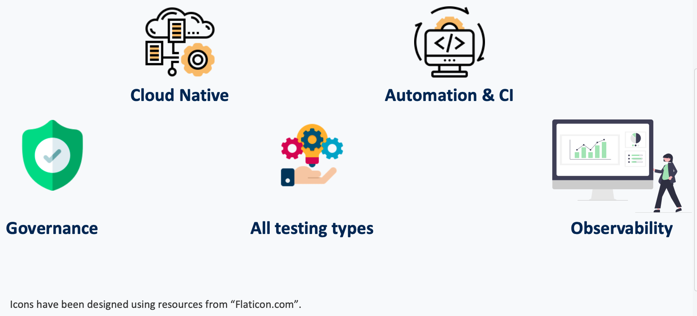
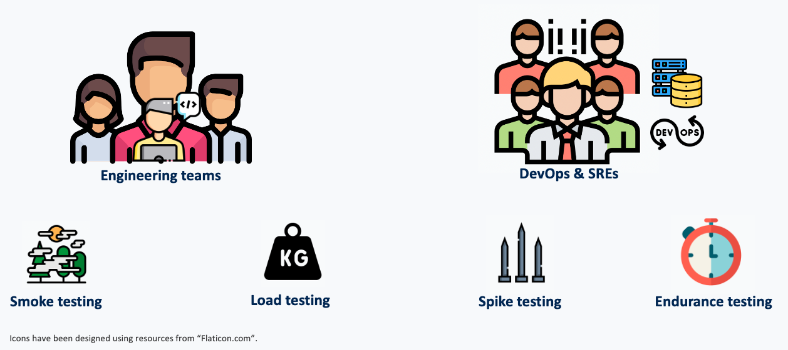

# Locust Kubernetes Operator

Enable performance testing for the modern era!
Utilize the full power of _[Locust](https://github.com/locustio/locust)_ in the cloud.

-----------------------------

[//]: # (Badges)
[![CI Pipeline][pipeline-status]][pipeline-status-url]
[![Codacy Badge][code-coverage]][code-coverage-url]
[![Codacy Badge][code-quality]][code-quality-url]

## At a glance

The _Operator_ is designed to unlock seamless & effortless distributed performance testing in the **_cloud_** and enable **_continues
integration for CI / CD_**. By design, the entire system is cloud native and focuses on automation and CI practices. One strong feature
about the system is its ability to **horizontally scale** to meet any required performance demands.

### What does it offer

Fundamentally, the _Operator_ provide the following as part of its core offerings; **cloud native**, **automation & CI**, **governance**,
**Observability**.

**Automation & CI**: By having automation as a core focus point, teams and organizations can build performance testing directly into CI/CD
pipelines. Meaning that every new service, feature or system can be potentially tested and validated for performance SLOs / SLAs.
**Governance**: Enable organizations to have governance over what / how resources are deployed and run on the cloud.
**Cloud cost optimization**: Using the _Operator_ enables for a more effective control over the **_cloud cost_**. Since resources are
**only** deployed when needed and **only** for as long as needed, the cost of performance testing is kept to a minimum.
**Observability**: For both engineering teams and cloud admins, the _Operator_ unlocks the ability to build observability & monitoring
dashboards in order to analyse test results during test runtime or retroactively (interesting for teams) and infrastructure usage and
resource monitoring ( interesting for
cloud admins, SREs, etc...).
**Separation of concerns**: By utilizing the _Operator_, _engineering teams_ can focus on building a robust performance test/s and SREs
DevOps teams can focus on managing the resources. This makes it so the barrier of entry is significantly lowered from an end-user
perspective.
**Test isolation** and **Parallel tests**: By default, the _Operator_ is able to support any number of Parallel test executions with an
absolute guarantee that each test is fully protected from being polluted by the existence of any number of other tests.

### Whom is it for

It is built for...

### Where can it run

Due to its design, the _Operator_ can be deployed on any kubernetes cluster. Meaning that it is possible to have a full cloud native
performance testing system anywhere in a matter of seconds.

### Limits

The only real limit to this approach is the amount of cluster resources a given team or an organization is willing to dedicate to
performance testing.

## How does it work

To run a performance test, basic configuration is provided through a simple and intuitive kubernetes custom resource. Once deployed the
_Operator_ does all the heavy work of creating and scheduling the resources while making sure that all created load generation pods can
effectively communicate with each other.
To handle the challenge of delivering test script/s from local environment to the cluster and in turn to the deployed _locust_ pods,
the _Operator_ support dynamic volume mounting from a configMaps source. This is indicated by a simple optional configuration. Meaning, if
the configuration is present, the volume is mounted, and if it is not, no volume is mounted.

Since a "_Picture Is Worth a Thousand Words_", here is a gif!

[//]: # (TODO: GIF here)

- demo steps
    - prepare a simple test
    - prepare a simple cr
- demo steps
    - cat test.py
    - cat cr.yaml
    - deploy configmap
    - deploy cr
    - open k9s and show test resources running

## Getting started

[//]: # ( TODO: Solved in issue #17)

## Roadmap

[//]: # ( TODO: List planned features)

## project status

The project is **_actively_** maintained and is under continues development and improvement. If you have any request or want to chat, kindly
open a ticket. If you wish to contribute code and / or ideas, kindly check the contribution section.

## Contribute

There's plenty to do, come say hi in [the issues](https://github.com/AbdelrhmanHamouda/locust-k8s-operator/issues)! 👋

Also check out the [CONTRIBUTING.MD](CONTRIBUTING.md) 🤓

## License

Open source licensed under Apache-2.0 license (see LICENSE file for details).

[//]: # (Pipeline status badge)
[pipeline-status]: https://github.com/AbdelrhmanHamouda/locust-k8s-operator/actions/workflows/ci.yaml/badge.svg?branch=master
[pipeline-status-url]: https://github.com/AbdelrhmanHamouda/locust-k8s-operator/actions/workflows/ci.yaml

[//]: # (Code coverage badge)
[code-coverage]: https://app.codacy.com/project/badge/Grade/70b76e69dbde4a9ebfd36ad5ccf6de78
[code-coverage-url]: https://www.codacy.com/gh/AbdelrhmanHamouda/locust-k8s-operator/dashboard?utm_source=github.com&amp;utm_medium=referral&amp;utm_content=AbdelrhmanHamouda/locust-k8s-operator&amp;utm_campaign=Badge_Grade

[//]: # (Code quality badge)
[code-quality]: https://app.codacy.com/project/badge/Coverage/70b76e69dbde4a9ebfd36ad5ccf6de78
[code-quality-url]: https://www.codacy.com/gh/AbdelrhmanHamouda/locust-k8s-operator/dashboard?utm_source=github.com&utm_medium=referral&utm_content=AbdelrhmanHamouda/locust-k8s-operator&utm_campaign=Badge_Coverage
