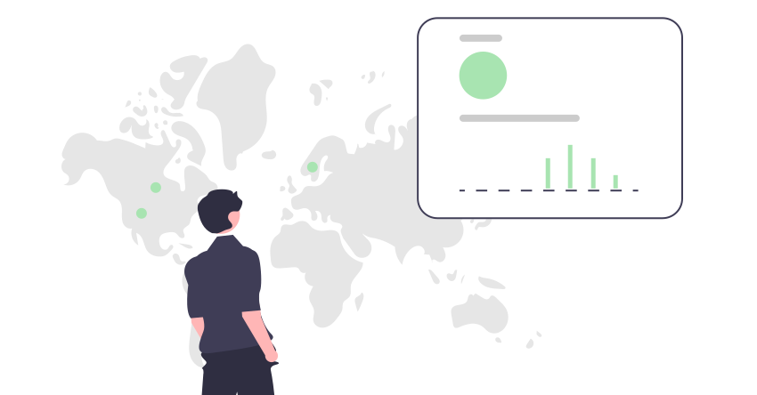

<div align="center" style="margin: 2rem 0;">
  
</div>

<h1 align="center" style="margin-top: 0.01rem;">Locust Kubernetes Operator</h1>

<p align="center">
Enable performance testing for the modern era!
</p>

<p align="center">
Utilize the full power of <em><a href="https://github.com/locustio/locust">Locust</a></em> in the cloud.
</p>

Docs: [github.io/locust-k8s-operator/](https://abdelrhmanhamouda.github.io/locust-k8s-operator/)

-----------------------------

[//]: # (Badges)
[![CI Pipeline][pipeline-status]][pipeline-status-url]
[![Security Scan][security-scan]][security-scan-url]
[![Codacy Badge][code-coverage]][code-coverage-url]
[![Codacy Badge][code-quality]][code-quality-url]
[![Documentation][docs]][docs-url]
[![Docker Pulls][docker-pulls]][docker-url]



## At a Glance

The Operator is designed to unlock seamless and effortless distributed performance testing in the cloud and enable continuous integration for CI/CD. By design, the entire system is cloud native and focuses on automation and CI practices. One strong feature about the system is its ability to horizontally scale to meet any required performance demands.

You describe a load test as a `LocustTest` custom resource. The operator creates the master and worker pods, wires them together, streams the results wherever you point them, and cleans everything up when the run finishes.

## What You Get

**Observability.** Export traces and metrics straight out of Locust with native OpenTelemetry, no sidecar involved. Prometheus scraping works out of the box for setups that aren't on OTLP yet.

**Control over placement.** Node affinity, taint tolerations, node selectors, and `runtimeClassName` for sandboxed runtimes such as gVisor or Kata Containers. Master and worker pods take independent resource specs, and CPU limits can be lifted entirely for latency-sensitive runs.

**Everything your test needs at runtime.** Inject credentials from Secrets and ConfigMaps as environment variables or file mounts. Mount test data and certificates from PVCs, ConfigMaps, or Secrets, targeted at the master, the workers, or both. Private registries are supported through `imagePullSecrets`.

**Kafka and AWS MSK** integration for testing event-driven systems, with authentication handled for you.

Tests run in isolation, so you can run many at once without cross-interference, and a configurable TTL tears down resources once a run is done. The [features page](https://abdelrhmanhamouda.github.io/locust-k8s-operator/features/) covers the full list.

## Documentation

All documentation for this project is available at [github.io/locust-k8s-operator/](https://abdelrhmanhamouda.github.io/locust-k8s-operator/).

## Quick Start

### Prerequisites

Kubernetes **1.29 or newer**, and Helm 3.x to install the chart.

For local development you'll also want Go 1.26+, Docker for building images, kubectl pointed at your cluster, and Kind if you plan to run the E2E suite.

### Installation

Install the operator using Helm:

```bash
helm repo add locust-k8s-operator https://abdelrhmanhamouda.github.io/locust-k8s-operator
helm install locust-operator locust-k8s-operator/locust-k8s-operator
```

Or from the repository:

```bash
helm install locust-operator charts/locust-k8s-operator/
```

Already running `locust.io/v1` resources? They keep working through the conversion webhook, and the [migration guide](https://abdelrhmanhamouda.github.io/locust-k8s-operator/migration/) walks through moving to `v2`. The v1 API is deprecated and slated for removal in v3.

### Development

```bash
# Install CRDs
make install

# Run operator locally (against configured cluster)
make run

# Run tests
make test

# Run E2E tests (requires Kind)
make test-e2e

# Build and push operator image
make docker-build docker-push IMG=<your-registry>/locust-operator:tag
```

See [CONTRIBUTING.md](CONTRIBUTING.md) for detailed development setup.

## Project Status

The project is actively maintained and under continuous development and improvement. If you have any request or want to chat, kindly open a ticket. If you wish to contribute code and/or ideas, kindly check the contribution section.

## Contribute

There's plenty to do, come say hi in [the issues](https://github.com/AbdelrhmanHamouda/locust-k8s-operator/issues)!

Also check out [CONTRIBUTING.md](CONTRIBUTING.md).

## License

Open source licensed under Apache-2.0 license (see LICENSE file for details).

[//]: # (Pipeline status badge)
[pipeline-status]: https://github.com/AbdelrhmanHamouda/locust-k8s-operator/actions/workflows/ci.yaml/badge.svg?branch=master
[pipeline-status-url]: https://github.com/AbdelrhmanHamouda/locust-k8s-operator/actions/workflows/ci.yaml

[//]: # (Security scan badge)
[security-scan]: https://github.com/AbdelrhmanHamouda/locust-k8s-operator/actions/workflows/security-scan-scheduled.yaml/badge.svg?branch=master
[security-scan-url]: https://github.com/AbdelrhmanHamouda/locust-k8s-operator/security/code-scanning

[//]: # (Code coverage badge)
[code-coverage]: https://app.codacy.com/project/badge/Coverage/70b76e69dbde4a9ebfd36ad5ccf6de78?branch=master
[code-coverage-url]: https://app.codacy.com/gh/AbdelrhmanHamouda/locust-k8s-operator/dashboard?utm_source=gh&utm_medium=referral&utm_content=&utm_campaign=Badge_coverage

[//]: # (Code quality badge)
[code-quality]: https://app.codacy.com/project/badge/Grade/70b76e69dbde4a9ebfd36ad5ccf6de78?branch=master
[code-quality-url]: https://app.codacy.com/gh/AbdelrhmanHamouda/locust-k8s-operator/dashboard?utm_source=gh&utm_medium=referral&utm_content=&utm_campaign=Badge_grade
[//]: # (Documentation badge)
[docs]: https://img.shields.io/badge/Documentation-gh--pages-green
[docs-url]:https://abdelrhmanhamouda.github.io/locust-k8s-operator/
[//]: # (Docker badge)
[docker-url]: https://hub.docker.com/r/lotest/locust-k8s-operator
[docker-pulls]:https://img.shields.io/docker/pulls/lotest/locust-k8s-operator?style=flat&logo=docker&logoColor=green&label=Image%20Pulls&color=green&link=https%3A%2F%2Fhub.docker.com%2Fr%2Flotest%2Flocust-k8s-operator
