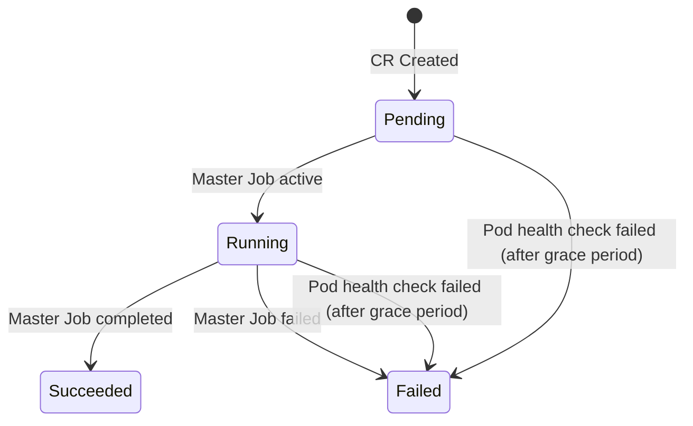

# API Reference

This document provides a complete reference for the LocustTest Custom Resource Definition (CRD).

## Overview

| Property | Value |
|----------|-------|
| **Group** | `locust.io` |
| **Kind** | `LocustTest` |
| **Versions** | v2 (recommended), v1 (deprecated) |
| **Short Name** | `lotest` |
| **Scope** | Namespaced |

---

## LocustTest v2 (Recommended)

The v2 API provides a cleaner, grouped configuration structure with new features.

### Spec Fields

#### Root Fields

| Field | Type | Required | Default | Description |
|-------|------|----------|---------|-------------|
| `image` | string | **Yes** | - | Container image for Locust pods (e.g., `locustio/locust:2.20.0`) |
| `imagePullPolicy` | string | No | `IfNotPresent` | Image pull policy: `Always`, `IfNotPresent`, `Never` |
| `imagePullSecrets` | []LocalObjectReference | No | - | Secrets for pulling from private registries (specify as `- name: secret-name`) |
| `master` | [MasterSpec](#masterspec) | **Yes** | - | Master pod configuration |
| `worker` | [WorkerSpec](#workerspec) | **Yes** | - | Worker pod configuration |
| `testFiles` | [TestFilesConfig](#testfilesconfig) | No | - | ConfigMap references for test files |
| `scheduling` | [SchedulingConfig](#schedulingconfig) | No | - | Affinity, tolerations, nodeSelector |
| `env` | [EnvConfig](#envconfig) | No | - | Environment variable injection |
| `volumes` | []corev1.Volume | No | - | Additional volumes to mount |
| `volumeMounts` | [][TargetedVolumeMount](#targetedvolumemount) | No | - | Volume mounts with target filtering |
| `observability` | [ObservabilityConfig](#observabilityconfig) | No | - | OpenTelemetry configuration |

#### MasterSpec

| Field | Type | Required | Default | Description |
|-------|------|----------|---------|-------------|
| `command` | string | **Yes** | - | Locust command seed (e.g., `--locustfile /lotest/src/test.py --host https://example.com`) |
| `resources` | corev1.ResourceRequirements | No | From operator config | CPU/memory requests and limits |
| `labels` | map[string]string | No | - | Additional labels for master pod |
| `annotations` | map[string]string | No | - | Additional annotations for master pod |
| `autostart` | bool | No | `true` | Start test automatically when workers connect |
| `autoquit` | [AutoquitConfig](#autoquitconfig) | No | `{enabled: true, timeout: 60}` | Auto-quit behavior after test completion |
| `extraArgs` | []string | No | - | Additional command-line arguments |

#### WorkerSpec

| Field | Type | Required | Default | Description |
|-------|------|----------|---------|-------------|
| `command` | string | **Yes** | - | Locust command seed (e.g., `--locustfile /lotest/src/test.py`) |
| `replicas` | int32 | **Yes** | - | Number of worker replicas (1-500) |
| `resources` | corev1.ResourceRequirements | No | From operator config | CPU/memory requests and limits |
| `labels` | map[string]string | No | - | Additional labels for worker pods |
| `annotations` | map[string]string | No | - | Additional annotations for worker pods |
| `extraArgs` | []string | No | - | Additional command-line arguments |

#### AutoquitConfig

| Field | Type | Required | Default | Description |
|-------|------|----------|---------|-------------|
| `enabled` | bool | No | `true` | Enable auto-quit after test completion |
| `timeout` | int32 | No | `60` | Seconds to wait before quitting after test ends |

#### TestFilesConfig

| Field | Type | Required | Default | Description |
|-------|------|----------|---------|-------------|
| `configMapRef` | string | No | - | ConfigMap containing test files |
| `libConfigMapRef` | string | No | - | ConfigMap containing library files |
| `srcMountPath` | string | No | `/lotest/src` | Mount path for test files |
| `libMountPath` | string | No | `/opt/locust/lib` | Mount path for library files |

#### SchedulingConfig

| Field | Type | Required | Default | Description |
|-------|------|----------|---------|-------------|
| `affinity` | corev1.Affinity | No | - | Standard Kubernetes affinity rules |
| `tolerations` | []corev1.Toleration | No | - | Standard Kubernetes tolerations |
| `nodeSelector` | map[string]string | No | - | Node selector labels |

#### EnvConfig

| Field | Type | Required | Default | Description |
|-------|------|----------|---------|-------------|
| `configMapRefs` | [][ConfigMapEnvSource](#configmapenvsource) | No | - | ConfigMaps to inject as environment variables |
| `secretRefs` | [][SecretEnvSource](#secretenvsource) | No | - | Secrets to inject as environment variables |
| `variables` | []corev1.EnvVar | No | - | Individual environment variables |
| `secretMounts` | [][SecretMount](#secretmount) | No | - | Secrets to mount as files |

#### ConfigMapEnvSource

| Field | Type | Required | Default | Description |
|-------|------|----------|---------|-------------|
| `name` | string | **Yes** | - | ConfigMap name |
| `prefix` | string | No | - | Prefix to add to all keys (e.g., `APP_`) |

#### SecretEnvSource

| Field | Type | Required | Default | Description |
|-------|------|----------|---------|-------------|
| `name` | string | **Yes** | - | Secret name |
| `prefix` | string | No | - | Prefix to add to all keys |

#### SecretMount

| Field | Type | Required | Default | Description |
|-------|------|----------|---------|-------------|
| `name` | string | **Yes** | - | Secret name |
| `mountPath` | string | **Yes** | - | Path to mount the secret |
| `readOnly` | bool | No | `true` | Mount as read-only |

#### TargetedVolumeMount

| Field | Type | Required | Default | Description |
|-------|------|----------|---------|-------------|
| `name` | string | **Yes** | - | Volume name (must match a volume in `volumes`) |
| `mountPath` | string | **Yes** | - | Path to mount the volume |
| `subPath` | string | No | - | Sub-path within the volume |
| `readOnly` | bool | No | `false` | Mount as read-only |
| `target` | string | No | `both` | Target pods: `master`, `worker`, or `both` |

#### ObservabilityConfig

| Field | Type | Required | Default | Description |
|-------|------|----------|---------|-------------|
| `openTelemetry` | [OpenTelemetryConfig](#opentelemetryconfig) | No | - | OpenTelemetry configuration |

#### OpenTelemetryConfig

| Field | Type | Required | Default | Description |
|-------|------|----------|---------|-------------|
| `enabled` | bool | No | `false` | Enable OpenTelemetry integration |
| `endpoint` | string | Required if enabled | - | OTel collector endpoint (e.g., `otel-collector:4317`) |
| `protocol` | string | No | `grpc` | Protocol: `grpc` or `http/protobuf` |
| `insecure` | bool | No | `false` | Use insecure connection |
| `extraEnvVars` | map[string]string | No | - | Additional OTel environment variables |

### Status Fields

| Field | Type | Description |
|-------|------|-------------|
| `phase` | string | Current lifecycle phase: `Pending`, `Running`, `Succeeded`, `Failed` |
| `observedGeneration` | int64 | Most recent generation observed by the controller |
| `expectedWorkers` | int32 | Number of expected worker replicas (from spec) |
| `connectedWorkers` | int32 | Approximate number of connected workers (from Job.Status.Active) |
| `startTime` | metav1.Time | When the test transitioned to Running |
| `completionTime` | metav1.Time | When the test reached Succeeded or Failed |
| `conditions` | []metav1.Condition | Standard Kubernetes conditions (see below) |

!!! note
    `connectedWorkers` is an approximation derived from the worker Job's active pod count. It may briefly lag behind actual Locust worker connections.

#### Phase Lifecycle



| Phase | Meaning | What to do |
|-------|---------|------------|
| `Pending` | Resources are being created (Service, master Job, worker Job). Initial state after CR creation. Also set during recovery after external resource deletion. | Wait for resources to be scheduled. Check events if stuck. |
| `Running` | Master Job has at least one active pod. Test execution is in progress. `startTime` is set on this transition. | Monitor worker connections and test progress. |
| `Succeeded` | Master Job completed successfully (exit code 0). `completionTime` is set. | Collect results. CR can be deleted or kept for records. |
| `Failed` | Master Job failed, or pod health checks detected persistent failures after the 2-minute grace period. `completionTime` is set. | Check pod logs and events for failure details. Delete and recreate to retry. |

The operator waits 2 minutes after pod creation before reporting pod health failures. This prevents false alarms during normal startup activities like image pulling, volume mounting, and scheduling.

#### Condition Types

**Ready**

| Status | Reason | Meaning |
|--------|--------|---------|
| `True` | `ResourcesCreated` | All resources (Service, Jobs) created successfully |
| `False` | `ResourcesCreating` | Resources are being created |
| `False` | `ResourcesFailed` | Test failed, resources in error state |

**WorkersConnected**

| Status | Reason | Meaning |
|--------|--------|---------|
| `True` | `AllWorkersConnected` | All expected workers have active pods |
| `False` | `WaitingForWorkers` | Initial state, waiting for worker pods |
| `False` | `WorkersMissing` | Some workers not yet active (shows N/M count) |

**TestCompleted**

| Status | Reason | Meaning |
|--------|--------|---------|
| `True` | `TestSucceeded` | Test completed successfully |
| `True` | `TestFailed` | Test completed with failure |
| `False` | `TestInProgress` | Test has not finished |

**PodsHealthy**

| Status | Reason | Meaning |
|--------|--------|---------|
| `True` | `PodsHealthy` | All pods running normally |
| `True` | `PodsStarting` | Within 2-minute grace period (not yet checking) |
| `False` | `ImagePullError` | One or more pods cannot pull container image |
| `False` | `ConfigurationError` | ConfigMap or Secret not found |
| `False` | `SchedulingError` | Pod cannot be scheduled (node affinity, resources) |
| `False` | `CrashLoopBackOff` | Container repeatedly crashing |
| `False` | `InitializationError` | Init container failed |

**SpecDrifted**

| Status | Reason | Meaning |
|--------|--------|---------|
| `True` | `SpecChangeIgnored` | CR spec was modified after creation. Changes are ignored. Delete and recreate to apply. |

!!! info
    The `SpecDrifted` condition only appears when a user edits the CR spec after initial creation. It serves as a reminder that tests are immutable.

#### Checking Status

```bash
# Quick status overview
kubectl get locusttest my-test

# Detailed status with conditions
kubectl get locusttest my-test -o jsonpath='{.status}' | jq .

# Watch phase changes in real-time
kubectl get locusttest my-test -w

# Check specific condition
kubectl get locusttest my-test -o jsonpath='{.status.conditions[?(@.type=="Ready")].status}'

# Check worker connection progress
kubectl get locusttest my-test -o jsonpath='{.status.connectedWorkers}/{.status.expectedWorkers}'
```

#### CI/CD Integration

Use `kubectl wait` to integrate LocustTest into CI/CD pipelines. The operator's status conditions follow standard Kubernetes conventions, making them compatible with any tool that supports `kubectl wait`.

**GitHub Actions example:**

```yaml
name: Load Test
on:
  workflow_dispatch:

jobs:
  load-test:
    runs-on: ubuntu-latest
    steps:
      - uses: actions/checkout@v4

      - name: Apply test
        run: kubectl apply -f locusttest.yaml

      - name: Wait for test completion
        run: |
          kubectl wait locusttest/my-test \
            --for=jsonpath='{.status.phase}'=Succeeded \
            --timeout=30m

      - name: Check result
        if: failure()
        run: |
          echo "Test failed or timed out"
          kubectl describe locusttest my-test
          kubectl logs -l performance-test-name=my-test --tail=50

      - name: Cleanup
        if: always()
        run: kubectl delete locusttest my-test --ignore-not-found
```

**Generic shell script example:**

```bash
#!/bin/bash
set -e

# Apply test
kubectl apply -f locusttest.yaml

# Wait for completion (either Succeeded or Failed)
echo "Waiting for test to complete..."
while true; do
  PHASE=$(kubectl get locusttest my-test -o jsonpath='{.status.phase}' 2>/dev/null)
  case "$PHASE" in
    Succeeded)
      echo "Test passed!"
      exit 0
      ;;
    Failed)
      echo "Test failed!"
      kubectl describe locusttest my-test
      exit 1
      ;;
    *)
      echo "Phase: $PHASE - waiting..."
      sleep 10
      ;;
  esac
done
```

### Complete v2 Example

```yaml
apiVersion: locust.io/v2
kind: LocustTest
metadata:
  name: comprehensive-test
spec:
  image: locustio/locust:2.20.0
  imagePullPolicy: IfNotPresent
  
  master:
    command: "--locustfile /lotest/src/test.py --host https://api.example.com --users 1000 --spawn-rate 50 --run-time 10m"
    resources:
      requests:
        memory: "256Mi"
        cpu: "100m"
      limits:
        memory: "512Mi"
        cpu: "500m"
    labels:
      role: master
    autostart: true
    autoquit:
      enabled: true
      timeout: 120
  
  worker:
    command: "--locustfile /lotest/src/test.py"
    replicas: 10
    resources:
      requests:
        memory: "512Mi"
        cpu: "500m"
      limits:
        memory: "1Gi"
        cpu: "1000m"
    labels:
      role: worker
  
  testFiles:
    configMapRef: my-test-scripts
    libConfigMapRef: my-lib-files
  
  scheduling:
    nodeSelector:
      node-type: performance
    tolerations:
      - key: "dedicated"
        operator: "Equal"
        value: "performance"
        effect: "NoSchedule"
  
  env:
    secretRefs:
      - name: api-credentials
        prefix: "API_"
    configMapRefs:
      - name: app-config
    variables:
      - name: LOG_LEVEL
        value: "INFO"
  
  volumes:
    - name: test-data
      persistentVolumeClaim:
        claimName: test-data-pvc
  
  volumeMounts:
    - name: test-data
      mountPath: /data
      target: both
  
  observability:
    openTelemetry:
      enabled: true
      endpoint: "otel-collector.monitoring:4317"
      protocol: "grpc"
      extraEnvVars:
        OTEL_SERVICE_NAME: "load-test"
        OTEL_RESOURCE_ATTRIBUTES: "environment=staging,team=platform"
```

---

## LocustTest v1 (Deprecated)

!!! warning "Deprecated"
    The v1 API is deprecated and will be removed in v3.0. Use v2 for new deployments. See the [Migration Guide](migration.md) for upgrade instructions.

### Spec Fields (v1)

| Field | Type | Required | Default | Description |
|-------|------|----------|---------|-------------|
| `masterCommandSeed` | string | **Yes** | - | Command seed for master pod |
| `workerCommandSeed` | string | **Yes** | - | Command seed for worker pods |
| `workerReplicas` | int32 | **Yes** | - | Number of worker replicas (1-500) |
| `image` | string | **Yes** | - | Container image |
| `imagePullPolicy` | string | No | `IfNotPresent` | Image pull policy |
| `imagePullSecrets` | []string | No | - | Pull secrets |
| `configMap` | string | No | - | ConfigMap for test files |
| `libConfigMap` | string | No | - | ConfigMap for library files |
| `labels` | PodLabels | No | - | Labels with `master` and `worker` maps |
| `annotations` | PodAnnotations | No | - | Annotations with `master` and `worker` maps |
| `affinity` | LocustTestAffinity | No | - | Custom affinity structure |
| `tolerations` | []LocustTestToleration | No | - | Custom toleration structure |

### v1 Example

```yaml
apiVersion: locust.io/v1
kind: LocustTest
metadata:
  name: basic-test
spec:
  image: locustio/locust:2.20.0
  masterCommandSeed: "--locustfile /lotest/src/test.py --host https://example.com"
  workerCommandSeed: "--locustfile /lotest/src/test.py"
  workerReplicas: 3
  configMap: test-scripts
```

---

## Kubectl Commands

```bash
# List all LocustTests
kubectl get locusttests
kubectl get lotest  # short name

# Describe a LocustTest
kubectl describe locusttest <name>

# Watch status changes
kubectl get locusttest <name> -w

# Delete a LocustTest
kubectl delete locusttest <name>
```

---

## Printer Columns

When listing LocustTests, the following columns are displayed:

| Column | Description |
|--------|-------------|
| NAME | Resource name |
| PHASE | Current phase (Pending/Running/Succeeded/Failed) |
| WORKERS | Requested worker count |
| CONNECTED | Connected worker count |
| IMAGE | Container image (priority column) |
| AGE | Time since creation |
