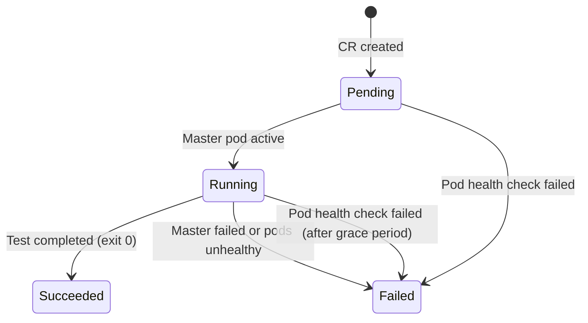

# Monitor test status and health

The operator reports test status through standard Kubernetes status fields and conditions. This guide shows you how to monitor test execution, detect failures, and integrate with CI/CD pipelines.

## How the operator reports test status

The operator updates `.status` on your LocustTest CR throughout its lifecycle:

- **Phase:** Current state (Pending → Running → Succeeded/Failed)
- **Conditions:** Detailed health indicators (Ready, WorkersConnected, PodsHealthy, etc.)
- **Worker counts:** Expected vs connected workers
- **Timestamps:** Start time and completion time

## Watch test progress

**Monitor phase changes in real-time:**

```bash
kubectl get locusttest my-test -w
```

**Expected output:**

```
NAME      PHASE      WORKERS   CONNECTED   AGE
my-test   Pending    5                     2s
my-test   Pending    5         0           5s
my-test   Running    5         3           12s
my-test   Running    5         5           18s
my-test   Succeeded  5         5           5m32s
```

**Output columns explained:**

| Column | Description |
|--------|-------------|
| NAME | LocustTest resource name |
| PHASE | Current lifecycle phase |
| WORKERS | Requested worker count (from spec) |
| CONNECTED | Active worker pods (approximation from Job status) |
| AGE | Time since CR creation |

### Phase progression

Tests move through these phases:



| Phase | Meaning | What to do |
|-------|---------|------------|
| **Pending** | Resources creating (Service, Jobs), pods scheduling | Wait for resources to schedule. Check events if stuck >2 minutes. |
| **Running** | Master pod active, test executing | Monitor worker connections and test progress. |
| **Succeeded** | Master job completed successfully (exit code 0) | Collect results. CR can be deleted or kept for records. |
| **Failed** | Master job failed or pods unhealthy (after 2-minute grace period) | Check pod logs and events. Delete and recreate to retry. |

!!! note "Grace period"
    The operator waits 2 minutes after pod creation before reporting pod health failures. This prevents false alarms during image pulls and startup.

## Check status conditions

Conditions provide detailed health information beyond the phase.

**View all conditions:**

```bash
kubectl get locusttest my-test -o jsonpath='{.status.conditions}' | jq .
```

**Example output:**

```json
[
  {
    "type": "Ready",
    "status": "True",
    "reason": "ResourcesCreated",
    "message": "All resources created successfully"
  },
  {
    "type": "WorkersConnected",
    "status": "True",
    "reason": "AllWorkersConnected",
    "message": "5/5 workers connected"
  },
  {
    "type": "PodsHealthy",
    "status": "True",
    "reason": "PodsHealthy",
    "message": "All pods running normally"
  }
]
```

### Key condition types

#### Ready

Indicates whether test resources were created successfully.

| Status | Reason | Meaning |
|--------|--------|---------|
| `True` | `ResourcesCreated` | All resources (Service, Jobs) created successfully |
| `False` | `ResourcesCreating` | Resources are being created |
| `False` | `ResourcesFailed` | Test failed, resources in error state |

#### WorkersConnected

Tracks worker connection progress.

| Status | Reason | Meaning |
|--------|--------|---------|
| `True` | `AllWorkersConnected` | All expected workers have active pods |
| `False` | `WaitingForWorkers` | Initial state, waiting for worker pods |
| `False` | `WorkersMissing` | Some workers not yet active (message shows N/M count) |

!!! note
    `connectedWorkers` is an approximation from Job.Status.Active. It may briefly lag behind actual Locust master connections.

#### PodsHealthy

Detects pod-level failures (crashes, scheduling issues, image pull errors).

| Status | Reason | Meaning |
|--------|--------|---------|
| `True` | `PodsHealthy` | All pods running normally |
| `True` | `PodsStarting` | Within 2-minute grace period (not yet checking health) |
| `False` | `ImagePullError` | One or more pods cannot pull container image |
| `False` | `ConfigurationError` | ConfigMap or Secret referenced in CR not found |
| `False` | `SchedulingError` | Pod cannot be scheduled (node affinity, insufficient resources) |
| `False` | `CrashLoopBackOff` | Container repeatedly crashing |
| `False` | `InitializationError` | Init container failed |

**Check a specific condition:**

```bash
kubectl get locusttest my-test -o jsonpath='{.status.conditions[?(@.type=="PodsHealthy")]}'
```

#### TestCompleted

Indicates whether the test has finished and the outcome.

| Status | Reason | Meaning |
|--------|--------|---------|
| `True` | `TestSucceeded` | Test completed successfully (master exited with code 0) |
| `True` | `TestFailed` | Test completed with failure |
| `False` | `TestInProgress` | Test is still running |

#### SpecDrifted

Appears when the CR spec is edited after creation, once the test has moved past the Pending phase.

| Status | Reason | Meaning |
|--------|--------|---------|
| `True` | `SpecChangeIgnored` | Spec was modified after creation. Changes ignored. Delete and recreate to apply. |

## Detect pod failures

When `PodsHealthy=False`, the operator detected a problem with test pods.

**Get condition details:**

```bash
kubectl describe locusttest my-test
```

Look for the `PodsHealthy` condition in the Status section. The message field explains what failed.

**Failure message format:**

Messages follow the pattern: `{FailureType}: {N} pod(s) affected [{pod-names}]: {error-detail}`

**Example failure messages:**

- `ImagePullError: 1 pod(s) affected [my-test-master-abc12]: ErrImagePull`
- `ConfigurationError: 3 pod(s) affected [my-test-worker-def34, my-test-worker-ghi56, my-test-worker-jkl78]: Secret "api-creds" not found`
- `SchedulingError: 2 pod(s) affected [my-test-worker-mno90, my-test-worker-pqr12]: 0/3 nodes available: insufficient cpu`
- `CrashLoopBackOff: 1 pod(s) affected [my-test-master-stu34]: CrashLoopBackOff`

**View pod states directly:**

The operator applies two label selectors to test pods:

| Label | Selects | Example |
|-------|---------|---------|
| `performance-test-name=<cr-name>` | All pods (master + workers) | `kubectl get pods -l performance-test-name=my-test` |
| `performance-test-pod-name=<cr-name>-<role>` | Specific role (master or worker) | `kubectl get pods -l performance-test-pod-name=my-test-worker` |

```bash
kubectl get pods -l performance-test-name=my-test
```

**Check pod logs for errors:**

```bash
# Master logs
kubectl logs job/my-test-master

# Worker logs (first worker pod)
kubectl logs job/my-test-worker --max-log-requests=1
```

### Common failure scenarios

| Symptom | Likely cause | How to investigate |
|---------|--------------|-------------------|
| Phase stuck in `Pending` | Pods not scheduling | `kubectl describe pod` for scheduling errors |
| `PodsHealthy=False` with `ImagePullError` | Wrong image name or missing imagePullSecret | Check image name in spec, verify secret exists |
| `PodsHealthy=False` with `ConfigurationError` | Missing ConfigMap or Secret | Verify referenced resources exist: `kubectl get configmap,secret` |
| Phase transitions to `Failed` immediately | Master pod crashed on startup | Check master logs for Python errors in locustfile |
| Workers never connect | Network policy or firewall | Verify workers can reach master service on port 5557 |

## CI/CD integration

Use `kubectl wait` to block until test completion. The operator follows Kubernetes condition conventions, making it compatible with standard CI/CD tools.

### GitHub Actions example

```yaml
name: Load Test
on:
  workflow_dispatch:

jobs:
  load-test:
    runs-on: ubuntu-latest
    steps:
      - uses: actions/checkout@v4

      - name: Apply test
        run: kubectl apply -f locusttest.yaml

      - name: Wait for test completion
        run: |
          kubectl wait locusttest/my-test \
            --for=jsonpath='{.status.phase}'=Succeeded \
            --timeout=30m

      - name: Check result
        if: failure()
        run: |
          echo "Test failed or timed out"
          kubectl describe locusttest my-test
          kubectl logs -l performance-test-name=my-test --tail=50

      - name: Cleanup
        if: always()
        run: kubectl delete locusttest my-test --ignore-not-found
```

### Generic shell script

```bash
#!/bin/bash
set -e

# Apply test
kubectl apply -f locusttest.yaml

# Wait for completion (Succeeded or Failed)
echo "Waiting for test to complete..."
while true; do
  PHASE=$(kubectl get locusttest my-test -o jsonpath='{.status.phase}' 2>/dev/null)
  case "$PHASE" in
    Succeeded)
      echo "Test passed!"
      exit 0
      ;;
    Failed)
      echo "Test failed!"
      kubectl describe locusttest my-test
      kubectl logs job/my-test-master --tail=50
      exit 1
      ;;
    Pending|Running)
      echo "Phase: $PHASE - waiting..."
      sleep 10
      ;;
    *)
      echo "Unknown phase: $PHASE"
      sleep 10
      ;;
  esac
done
```

**Wait patterns:**

```bash
# Wait for specific phase
kubectl wait locusttest/my-test --for=jsonpath='{.status.phase}'=Succeeded --timeout=30m

# Wait for condition
kubectl wait locusttest/my-test --for=condition=Ready --timeout=5m

# Check if test completed (success or failure)
PHASE=$(kubectl get locusttest my-test -o jsonpath='{.status.phase}')
if [ "$PHASE" = "Succeeded" ]; then
  echo "Test passed"
elif [ "$PHASE" = "Failed" ]; then
  echo "Test failed"
  exit 1
fi
```

## Check worker connection progress

Monitor how many workers have connected to the master:

```bash
kubectl get locusttest my-test -o jsonpath='{.status.connectedWorkers}/{.status.expectedWorkers}'
```

**Example output:** `5/5` (all workers connected)

**View WorkersConnected condition:**

```bash
kubectl get locusttest my-test -o jsonpath='{.status.conditions[?(@.type=="WorkersConnected")]}'
```

If workers aren't connecting:

1. **Check worker pod status:**
   ```bash
   kubectl get pods -l performance-test-pod-name=my-test-worker
   ```

2. **Verify master service exists:**
   ```bash
   kubectl get service my-test-master
   ```

3. **Check worker logs for connection errors:**
   ```bash
   kubectl logs job/my-test-worker --max-log-requests=1 | grep -i connect
   ```

## Related guides

- [Configure OpenTelemetry integration](configure-opentelemetry.md) — Export metrics and traces from tests
- [API Reference - Status Fields](../../api_reference.md#status-fields) — Complete status field documentation
- [Metrics & Dashboards](../../metrics_and_dashboards.md) — Monitor test metrics with Prometheus
