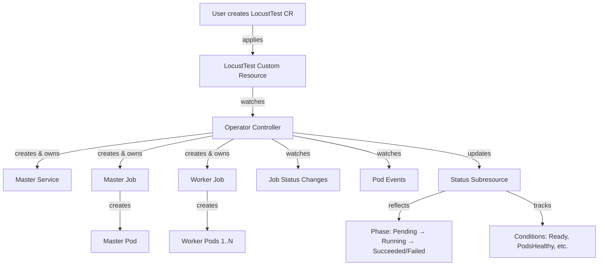
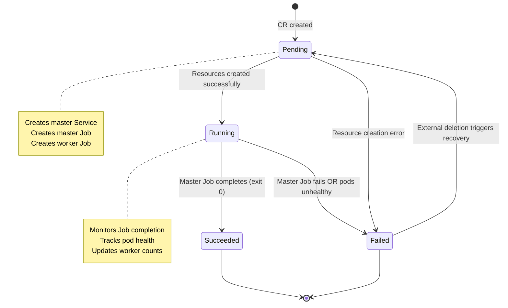
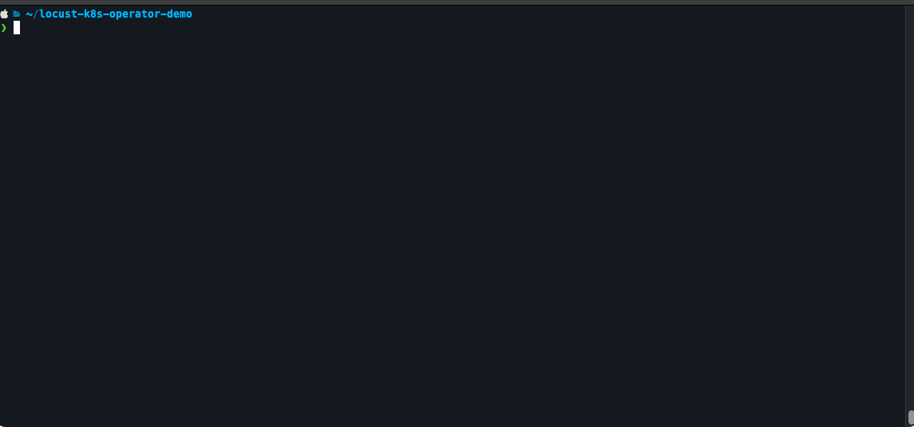

# How does it work

To run a performance test, basic configuration is provided through a simple and intuitive Kubernetes custom resource. Once deployed, the _Operator_ does all the heavy work of creating and scheduling the resources while making sure that all created load generation pods can effectively communicate with each other.

## Architecture Overview

The Locust K8s Operator is built using **Go** with the [controller-runtime](https://github.com/kubernetes-sigs/controller-runtime) framework, following the standard Kubernetes operator pattern.

When you create a LocustTest CR, the controller picks it up and orchestrates the creation of all necessary resources. Here's how the pieces fit together:



The controller maintains full ownership of created resources through [owner references](https://kubernetes.io/docs/concepts/overview/working-with-objects/owners-dependents/), ensuring automatic cleanup when the LocustTest CR is deleted.

## Reconciliation Loop

The operator follows an event-driven reconciliation pattern. Reconciliation is triggered by:

- **LocustTest CR events**: create, update, or delete operations
- **Owned Job status changes**: when the master or worker Job completes or fails
- **Pod state changes**: when pods enter CrashLoopBackOff, fail to schedule, or encounter errors

The controller implements a phase-based state machine to track test lifecycle:



### What Happens in Each Phase

**Pending** — The controller creates three core resources:

- A master Service (headless, for worker-to-master communication)
- A master Job (single pod running Locust master)
- A worker Job (N pods running Locust workers)

All resources have owner references pointing to the LocustTest CR. Once creation succeeds, the phase transitions to Running.

**Running** — The controller monitors:

- Job completion status (success or failure)
- Pod health across all master and worker pods
- Worker connection counts (approximate, from Job status)

**Succeeded/Failed** — Terminal states. The test has completed or encountered unrecoverable errors. Resources remain until CR deletion.

### Status Updates are Conflict-Safe

The controller uses a **retry-on-conflict** pattern for all status updates. If two reconcile loops try to update status simultaneously (e.g., from a Job event and a Pod event), the controller automatically retries with the latest resource version. This prevents status overwrites and ensures eventual consistency.

### Self-Healing Behavior

If external tools delete the Service or Jobs while the test is Running, the controller detects the missing resources and transitions back to Pending. On the next reconcile, it recreates everything from scratch. This self-healing ensures tests can recover from accidental `kubectl delete` operations.

## Validation Webhooks

Before a LocustTest CR reaches the controller, it passes through a **ValidatingWebhookConfiguration** that intercepts create and update requests. The webhook validates:

!!! tip "What Gets Validated"
    - **CR name length**: Ensures generated resource names (like `{name}-worker`) stay under the 63-character Kubernetes limit
    - **Secret mount path conflicts**: Prevents users from mounting secrets into reserved paths like `/lotest/src` (where test files live)
    - **Volume name conflicts**: Blocks use of reserved volume names like `secret-*` or `locust-lib`
    - **OpenTelemetry configuration**: When OTel is enabled, the webhook enforces that `endpoint` is provided

The webhook catches misconfigurations **before** they hit the controller, giving users immediate feedback with clear error messages. This design prevents invalid CRs from cluttering the cluster or causing cryptic pod errors.

## Pod Health Monitoring

The controller doesn't just watch Jobs — it actively monitors **pod health** to surface issues early.

### How Pod Watching Works

Jobs create Pods, so the ownership chain is: `LocustTest → Job → Pod`. Since Pods aren't directly owned by the LocustTest, we use a **custom mapping function** in the controller setup:

```go
Watches(&corev1.Pod{},
    handler.EnqueueRequestsFromMapFunc(r.mapPodToLocustTest),
)
```

This function walks the owner chain: when a Pod event occurs, it finds the owning Job, then finds the LocustTest that owns the Job, and triggers a reconcile on that LocustTest.

### Grace Period for Startup

Pods take time to start — scheduling, image pulls, volume mounts — so the controller applies a **2-minute grace period** after the oldest pod is created. During this window, pod failures are ignored to avoid false positives during normal startup.

After the grace period expires, the controller analyzes all pods for:

- **CrashLoopBackOff**: Container repeatedly crashing
- **ImagePullBackOff**: Can't pull the specified image
- **CreateContainerConfigError**: Missing ConfigMap or invalid volume mounts
- **Scheduling errors**: No nodes available, insufficient resources, etc.

When unhealthy pods are detected, the controller adds a condition to the LocustTest status with the failure reason and affected pod names. For ConfigMap errors, it even extracts the missing ConfigMap name and suggests creating it.

### Self-Healing from External Deletion

If a user or automation deletes the master Service or any Job while the test is Running, the controller detects the missing resource during the next reconcile. It immediately transitions the LocustTest back to Pending and recreates all resources from scratch. This ensures tests can recover from accidental deletions without manual intervention.

## Leader Election & High Availability

When running multiple replicas of the operator (recommended for production), **leader election** ensures only one instance actively reconciles resources at a time.

### How It Works

The operator uses Kubernetes **Lease objects** for leader election. When `--leader-elect` is enabled (the default in the Helm chart), all replicas compete for leadership:

- One instance acquires the lease and becomes the **active leader**
- Other replicas become **standby followers**, ready to take over
- If the leader pod crashes or is evicted, a standby acquires the lease within seconds
- The new leader picks up reconciliation seamlessly using the LocustTest status

### Why This Matters

Leader election prevents:

- **Split-brain scenarios**: Multiple controllers trying to create the same resources
- **Resource conflicts**: Two controllers racing to update status
- **Operator downtime**: If one replica fails, another takes over instantly

The default Helm deployment runs **2 replicas with leader election enabled**, providing high availability without resource waste.

!!! info "Leader Election in Development"
    Local development typically runs with `--leader-elect=false` for simplicity. Multi-replica setups with leader election are primarily for production resilience.

## Key Design Decisions

### Immutable Tests

Tests are **immutable by design**. Once a LocustTest CR is created, updates to its `spec` are **ignored** by the operator. The operator sets a `SpecDrifted` condition on the CR to indicate when spec changes have been detected but not applied.

To change test parameters (image, commands, replicas, etc.), **delete and recreate** the CR:

```bash
# Delete the existing test
kubectl delete locusttest <test-name>

# Edit your CR YAML with the desired changes, then re-apply
kubectl apply -f locusttest-cr.yaml
```

This design ensures:

- **Predictable behavior** — each test run uses exactly the configuration it was created with
- **Clean test isolation** — no mid-flight configuration drift
- **Simple lifecycle** — create, run, observe, delete

### Owner References

All created resources (Jobs, Services) have owner references pointing to the LocustTest CR. This enables:

- Automatic garbage collection on CR deletion
- Clear resource ownership in `kubectl get`
- No orphaned resources

### Status Tracking

The operator maintains rich status information:

```yaml
status:
  phase: Running
  expectedWorkers: 5
  connectedWorkers: 5
  startTime: "2026-01-15T10:00:00Z"
  conditions:
    - type: Ready
      status: "True"
      lastTransitionTime: "2026-01-15T10:00:05Z"
      reason: AllWorkersConnected
      message: "All 5 workers connected to master"
```

## Demo

Since a "_Picture Is Worth a Thousand Words_", here is a gif!


### Steps performed in demo

-   :material-file-code-outline: Test ConfigMap created in cluster
-   :material-file-document-edit-outline: LocustTest CR deployed into the cluster
-   :material-robot-outline: The _Operator_ creating, configuring and scheduling test resources on CR creation event
-   :material-delete-sweep-outline: The _Operator_ cleaning up test resources after test CR has been removed
