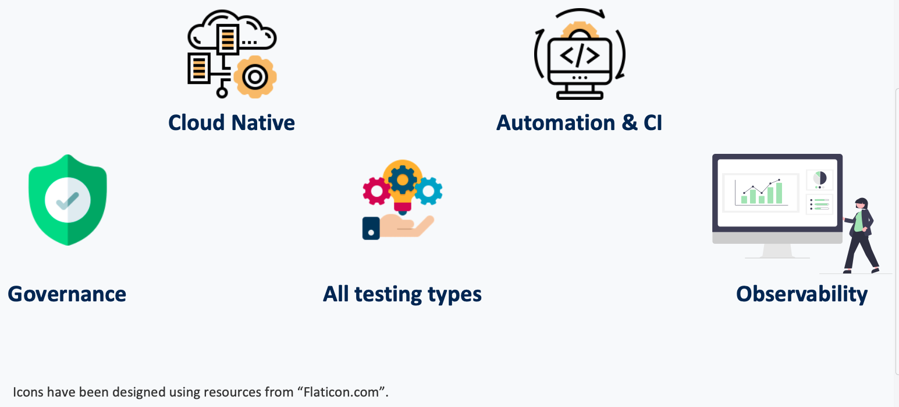
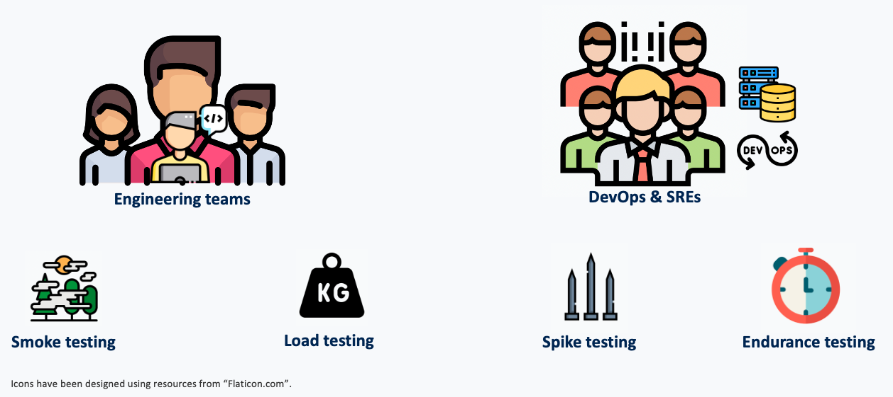

# Performance testing that simply works

Utilize the full power of <em>Locust</em> in the cloud with a fully automated, cloud-native approach, creating professional and reliable performance tests in minutes.

  

  <a href="getting_started/" class="md-button md-button--primary">
    Get started in 5 minutes
  </a>
  <a href="https://github.com/AbdelrhmanHamouda/locust-k8s-operator" class="md-button" target="_blank" rel="noopener noreferrer">
    View on GitHub
  </a>

## Find Your Path

-   :material-scale-balance:{ .lg .middle } **Evaluating Solutions?**

    ---

    Compare the Locust Kubernetes Operator with alternatives in under 30 seconds.

    [:octicons-arrow-right-24: Compare alternatives](comparison.md)

-   :material-rocket-launch:{ .lg .middle } **Ready to Start?**

    ---

    Deploy your first distributed load test on Kubernetes in 5 minutes with our step-by-step guide.

    [:octicons-arrow-right-24: Quick start guide](getting_started/index.md)

-   :material-book-open-variant:{ .lg .middle } **Need API Details?**

    ---

    Jump straight to the complete API field reference, resource configuration, and status lifecycle documentation.

    [:octicons-arrow-right-24: API Reference](api_reference.md)

  

    
    
    
    
  

## 🚀 Experience the Power of v2.0 { .text-center }

-   :material-language-go:{ .lg .middle } __Rebuilt in Go__

    ---

    Experience **60x faster startup times** and a **4x smaller memory footprint**. The entire operator has been rewritten in Go for maximum efficiency and reliability.

    [:octicons-arrow-right-24: Read the migration guide](migration.md)

-   :material-eye-check:{ .lg .middle } __OpenTelemetry__

    ---

    Gain deep visibility with built-in tracing and metrics. No sidecars required—just pure, cloud-native observability.

    [:octicons-arrow-right-24: Learn more](how-to-guides/observability/configure-opentelemetry.md)

-   :material-key-variant:{ .lg .middle } __Secret Injection__

    ---

    Securely manage your test credentials with native Kubernetes Secret and ConfigMap injection directly into your test pods.

    [:octicons-arrow-right-24: Learn more](how-to-guides/security/inject-secrets.md)

-   :material-harddisk:{ .lg .middle } __Volume Mounting__

    ---

    Mount any storage volume to your master and worker pods for flexible test data and configuration management.

    [:octicons-arrow-right-24: Learn more](how-to-guides/configuration/mount-volumes.md)

## Build for cloud-native performance testing { .text-center }

The _Operator_ is designed to unlock seamless & effortless distributed performance testing in the **_cloud_** and enable **_continuous integration for CI/CD pipelines_**. By design, the entire system is cloud native and focuses on automation and CI practices. One strong feature
about the system is its ability to **horizontally scale** to meet any required performance demands.

### Key capabilities { .text-center }

-   :material-cloud-check:{ .lg .middle } __Cloud Native__

    ---

    Leverage the full power of Kubernetes and cloud-native technologies for distributed performance testing.

    [:octicons-arrow-right-24: Learn more](features.md#cloud-native)

-   :material-robot-happy:{ .lg .middle } __Automation & CI__

    ---

    Integrate performance testing directly into your CI/CD pipelines for continuous validation.

    [:octicons-arrow-right-24: Learn more](features.md#automation)

-   :material-shield-check:{ .lg .middle } __Governance__

    ---

    Maintain control over how resources are deployed and used in the cloud.

    [:octicons-arrow-right-24: Learn more](features.md#governance)

-   :material-chart-bar:{ .lg .middle } __Observability__

    ---

    Gain insights into test results and infrastructure usage with built-in observability features.

    [:octicons-arrow-right-24: Learn more](features.md#observability)

[Check out the full list of features!](features.md)

## Designed for teams and organizations { .text-center }

### Who is it for { .text-center }

It is built for performance engineers, DevOps teams, and organizations looking to integrate performance testing into their CI/CD pipelines.

### Universal deployment { .text-center }

Due to its design, the _Operator_ can be deployed on any Kubernetes cluster. This means you can have a full cloud-native
performance testing system anywhere in a matter of seconds.

### Scalable resources { .text-center }

The only real limit to this approach is the amount of cluster resources a team or organization is willing to dedicate to
performance testing. Scale up or down based on your needs.

[//]: # (Pipeline status badge)
[pipeline-status]: https://github.com/AbdelrhmanHamouda/locust-k8s-operator/actions/workflows/ci.yaml/badge.svg?branch=master
[pipeline-status-url]: https://github.com/AbdelrhmanHamouda/locust-k8s-operator/actions/workflows/ci.yaml

[//]: # (Code coverage badge)
[code-coverage]: https://app.codacy.com/project/badge/Grade/70b76e69dbde4a9ebfd36ad5ccf6de78
[code-coverage-url]: https://www.codacy.com/gh/AbdelrhmanHamouda/locust-k8s-operator/dashboard?utm_source=github.com&amp;utm_medium=referral&amp;utm_content=AbdelrhmanHamouda/locust-k8s-operator&amp;utm_campaign=Badge_Grade

[//]: # (Code quality badge)
[code-quality]: https://app.codacy.com/project/badge/Coverage/70b76e69dbde4a9ebfd36ad5ccf6de78
[code-quality-url]: https://www.codacy.com/gh/AbdelrhmanHamouda/locust-k8s-operator/dashboard?utm_source=github.com&utm_medium=referral&utm_content=AbdelrhmanHamouda/locust-k8s-operator&utm_campaign=Badge_Coverage

[//]: # (common urls)
[contributing-url]: https://github.com/AbdelrhmanHamouda/locust-k8s-operator/blob/master/CONTRIBUTING.md
[issues-url]: https://github.com/AbdelrhmanHamouda/locust-k8s-operator/issues
[LocustTest]:https://github.com/AbdelrhmanHamouda/locust-k8s-operator/tree/master/kube/crd/locust-test-crd.yaml
[cr-example]: https://github.com/AbdelrhmanHamouda/locust-k8s-operator/tree/master/kube/sample-cr/locust-test-cr.yaml

[//]: # (Docker badge)
[docker-url]: https://hub.docker.com/r/lotest/locust-k8s-operator
[docker-pulls]:https://img.shields.io/docker/pulls/lotest/locust-k8s-operator?style=flat&logo=docker&logoColor=green&label=Image%20Pulls&color=green&link=https%3A%2F%2Fhub.docker.com%2Fr%2Flotest%2Flocust-k8s-operator
