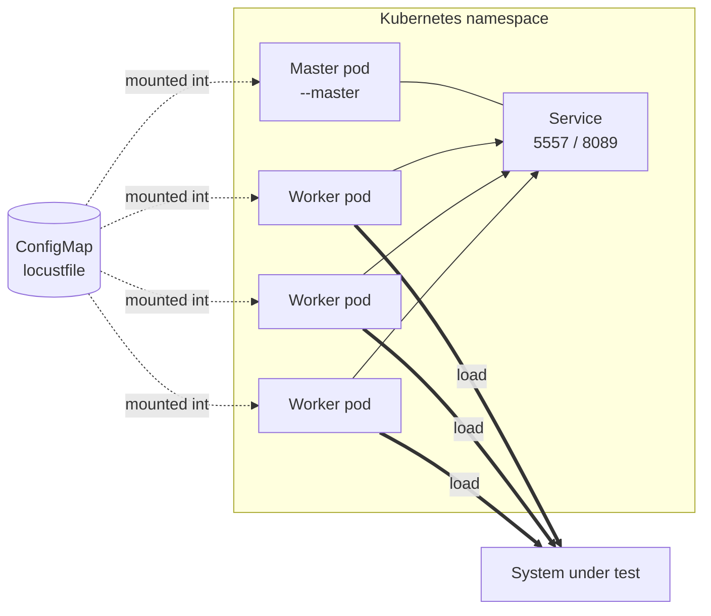

# Locust on Kubernetes: a practical guide

[Locust](https://locust.io/) is happy on a laptop until one machine can't produce the load you need. At that point you switch to Locust's distributed mode, and Kubernetes is a natural place to run it: you get as many worker pods as the cluster can schedule, the test runs close to the system under test, and the whole thing can be started from a CI job.

This page explains how distributed Locust maps onto Kubernetes, compares the three usual ways of deploying it, and then walks through a complete run with the Locust Kubernetes Operator (this project). If you only want the commands, skip to the [walkthrough](#walkthrough-with-the-locust-kubernetes-operator).

## How distributed Locust works on Kubernetes

A distributed Locust run has one **master** and any number of **workers**.

- The master doesn't simulate users. It hands out work, collects statistics from the workers, serves the web UI on port 8089 and listens for workers on port 5557.
- Each worker runs the simulated users from your locustfile and reports back to the master.

On Kubernetes that turns into:



- one pod running `locust --master`
- a Service in front of it, so workers have a stable address for port 5557
- N pods running `locust --worker --master-host=<service>`
- your locustfile in a ConfigMap (or baked into an image) mounted into every pod, because master and workers must run the same file

A few things catch people out the first time:

- **One CPU core per worker.** A Locust process uses a single core. Adding users to a worker that's already at 100% CPU doesn't add load, it just skews response times. Locust logs a warning when a worker goes above 90% CPU; when you see it, add workers rather than users.
- **Start-up order.** Workers keep retrying for a while until the master is reachable, so order doesn't matter much, but the master should wait until all workers have connected before it starts. Locust's `--expect-workers` flag does that.
- **Knowing when a run has finished.** With `--headless` (or `--autostart`) and `--run-time`, the master stops on its own. `--autoquit` then makes the processes exit, and Locust's exit code tells you whether the run had failures. Without that, pods sit there after the test and nobody knows whether it passed.
- **Cleaning up.** Every run leaves pods, a Service and usually a ConfigMap behind unless something removes them.

## Three ways to deploy it

### Plain manifests

You write the master Deployment or Job, the Service, the worker Deployment and the ConfigMap yourself. Locust's own docs on [distributed load generation](https://docs.locust.io/en/stable/running-distributed.html) cover the flags.

This is the best way to learn how the pieces fit, and there's nothing extra to install. The cost shows up later: you own start-up flags, pass/fail detection, re-runs (usually "delete everything and apply again") and clean-up, and running two tests side by side means templating names yourself.

### A Helm chart

The community [`deliveryhero/locust`](https://github.com/deliveryhero/helm-charts/tree/master/stable/locust) chart templates the master, workers and ConfigMaps for you, and worker count is a value.

It suits a long-lived Locust installation that people drive from the web UI. It's less suited to automated runs: the chart deploys Deployments that keep running after a test, so there's no built-in notion of a test finishing, passing or failing, and a CI job needs its own scripting around `helm install` and `helm uninstall`.

### An operator

With an operator, each test is a Kubernetes object. You `kubectl apply` a `LocustTest`, the operator creates the master, workers and Service, reports progress in the object's status, and removes everything when you delete it.

There are two Locust operators, and they can't be installed in the same cluster (see the [FAQ](faq.md#can-i-install-this-operator-alongside-locustiok8s-operator)):

- the **Locust Kubernetes Operator** (this project, written in Go, `locust.io/v2` API)
- **[locustio/k8s-operator](https://github.com/locustio/k8s-operator)**, a Python operator from the Locust team (`locust.io/v1` API, release 0.1.6 from January 2026)

[Compare alternatives](comparison.md) has the feature-by-feature table.

### At a glance

| | Plain manifests | Helm chart | Operator |
|---|---|---|---|
| Extra components in the cluster | None | None | Operator Deployment and a CRD |
| Start a run | `kubectl apply` several objects | `helm install` | `kubectl apply` one `LocustTest` |
| Knows when a run has finished | No | No | Yes (status phase) |
| Pass/fail for CI | Script it yourself | Script it yourself | `Succeeded` / `Failed` phase |
| Clean-up | Manual | `helm uninstall` | Delete the `LocustTest`, or a TTL |
| Several tests at once | Rename everything | One release per test | One `LocustTest` per test |
| Flexibility | Anything Kubernetes allows | What the chart exposes | What the CRD exposes |

If you run a load test once to learn, plain manifests are fine. If load tests are part of your release process, the lifecycle handling in an operator saves you writing it yourself.

## Walkthrough with the Locust Kubernetes Operator

You'll need a Kubernetes 1.29+ cluster (Kind, Minikube or any managed cluster), `kubectl` and Helm 3. This is the same flow as the [Quick Start](getting_started/index.md), with a bit more explanation.

### 1. Install the operator

```bash
helm repo add locust-k8s-operator https://abdelrhmanhamouda.github.io/locust-k8s-operator/
helm repo update

helm install locust-operator locust-k8s-operator/locust-k8s-operator \
  --namespace locust-system \
  --create-namespace
```

This installs the `LocustTest` CRD and the operator Deployment. [Install the operator](helm_deploy.md) lists the chart values, including webhooks and the optional OpenTelemetry collector.

### 2. Put your locustfile in a ConfigMap

```bash
cat > demo_test.py << 'EOF'
from locust import HttpUser, task

class DemoUser(HttpUser):
    @task
    def get_homepage(self):
        self.client.get("/")
EOF

kubectl create configmap demo-test --from-file=demo_test.py
```

The operator mounts the ConfigMap at `/lotest/src/` in the master and every worker. For tests split across several files, `testFiles.libConfigMapRef` mounts a second ConfigMap with your helper modules; see the [API reference](api_reference.md).

### 3. Describe the test

```yaml title="demo.yaml"
apiVersion: locust.io/v2
kind: LocustTest
metadata:
  name: demo
spec:
  image: locustio/locust:2.43.3
  testFiles:
    configMapRef: demo-test
  master:
    command: >-
      --locustfile /lotest/src/demo_test.py
      --host https://httpbin.org
      --users 10 --spawn-rate 2 --run-time 1m
  worker:
    command: "--locustfile /lotest/src/demo_test.py"
    replicas: 2
```

```bash
kubectl apply -f demo.yaml
```

You only pass your own Locust flags. The operator adds `--master`, `--expect-workers`, `--autostart` and `--autoquit 60` to the master, and `--worker --master-host=demo-master` to the workers. It creates a `demo-master` Job, a `demo-worker` Job with two pods, and a `demo-master` Service.

### 4. Watch it run

```bash
kubectl get locusttest demo -w
```

```
NAME   PHASE       WORKERS   CONNECTED   AGE
demo   Pending     2         0           2s
demo   Running     2         2           15s
demo   Succeeded   2         2           80s
```

`CONNECTED` is the number of workers the master has actually heard from. If it stays below `WORKERS`, the [FAQ](faq.md#workers-show-0n-connected) has the usual causes. [Monitor test status](how-to-guides/observability/monitor-test-status.md) explains every phase and condition.

### 5. Look at the results

While the test is running, the Locust web UI is on the master:

```bash
kubectl port-forward job/demo-master 8089:8089
```

Then open <http://localhost:8089>.

Once it's finished, the summary table is in the master's log:

```bash
kubectl logs job/demo-master
```

For anything longer-lived than a log:

- **Metrics.** Locust's native OpenTelemetry export, or the Prometheus exporter sidecar the operator adds to the master. Both are covered in [Metrics & Dashboards](metrics_and_dashboards.md).
- **Report files.** Add Locust's `--csv` or `--html` flags to the master command and write to a volume you [mount into the master](how-to-guides/configuration/mount-volumes.md).

### 6. Clean up

```bash
kubectl delete locusttest demo
kubectl delete configmap demo-test
```

Deleting the `LocustTest` removes its Jobs, pods and Service. To have finished tests removed for you, set a [TTL](how-to-guides/configuration/configure-ttl.md).

## Running it from CI

A finished test ends in the `Succeeded` or `Failed` phase, and the `TestCompleted` condition turns `True` either way. A pipeline step can therefore apply the test, wait, and fail the build if the run failed:

```bash
TEST_NAME="checkout-$(date +%Y%m%d-%H%M%S)"
sed "s/name: demo/name: ${TEST_NAME}/" demo.yaml | kubectl apply -f -

kubectl wait "locusttest/${TEST_NAME}" \
  --for=condition=TestCompleted --timeout=15m

PHASE=$(kubectl get locusttest "${TEST_NAME}" -o jsonpath='{.status.phase}')
kubectl logs "job/${TEST_NAME}-master" > locust-summary.txt
kubectl delete locusttest "${TEST_NAME}"

[ "$PHASE" = "Succeeded" ]
```

Some notes for pipelines:

- Use a unique name per run. A `LocustTest` can't be edited once it's running, so re-running means a new object (or delete and re-apply).
- By default Locust exits with code 1 if any request failed, and the operator turns that into `Failed`. To pass or fail on thresholds instead, set the exit code yourself in a `quitting` hook in the locustfile:

    ```python
    from locust import events

    @events.quitting.add_listener
    def check_thresholds(environment, **kwargs):
        stats = environment.stats.total
        too_many_errors = stats.fail_ratio > 0.01
        too_slow = stats.get_response_time_percentile(0.95) > 800
        environment.process_exit_code = 1 if (too_many_errors or too_slow) else 0
    ```

- The [CI/CD tutorial](tutorials/ci-cd-integration.md) has a complete GitHub Actions workflow, including saving the results as build artefacts and running on a schedule.
- Pin the Locust image tag so a run today and a run next month use the same Locust.

## Scaling workers

Set `spec.worker.replicas` (1 to 500). As a starting point, plan for roughly 50 users per worker for typical HTTP tests and give each worker one CPU core, then adjust from what you see: if worker CPU is near 100%, add workers; if it's low, you can push more users per worker. Switching to Locust's `FastHttpUser` also gets noticeably more requests out of each core.

Because a running test can't be edited, changing the worker count means deleting the test and applying it again. [Scale worker replicas](how-to-guides/scaling/scale-workers.md) covers sizing in more detail, and [Configure resources](how-to-guides/configuration/configure-resources.md) covers CPU and memory requests. To keep load generators off your application nodes, use [node selectors](how-to-guides/scaling/use-node-selector.md), [affinity](how-to-guides/scaling/use-node-affinity.md) or [tolerations](how-to-guides/scaling/configure-tolerations.md).

## Where to go next

- [Your First Load Test](tutorials/first-load-test.md): a more realistic test with several user tasks.
- [Inject secrets](how-to-guides/security/inject-secrets.md): API tokens and credentials for the system under test.
- [Production Deployment](tutorials/production-deployment.md): resources, scheduling and observability for larger runs.
- [FAQ](faq.md): common problems and how to fix them.
